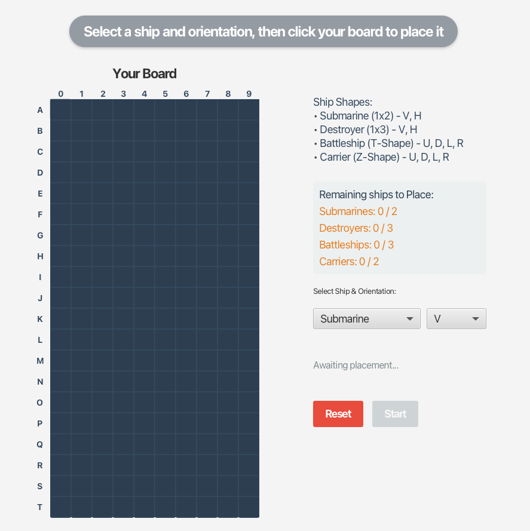
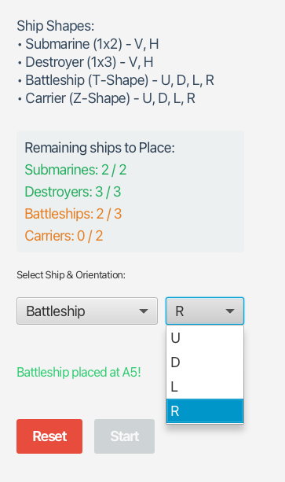
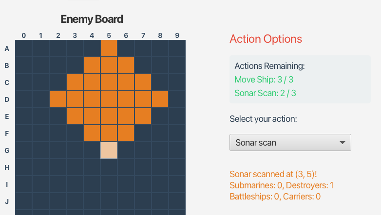
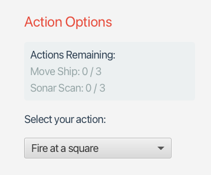
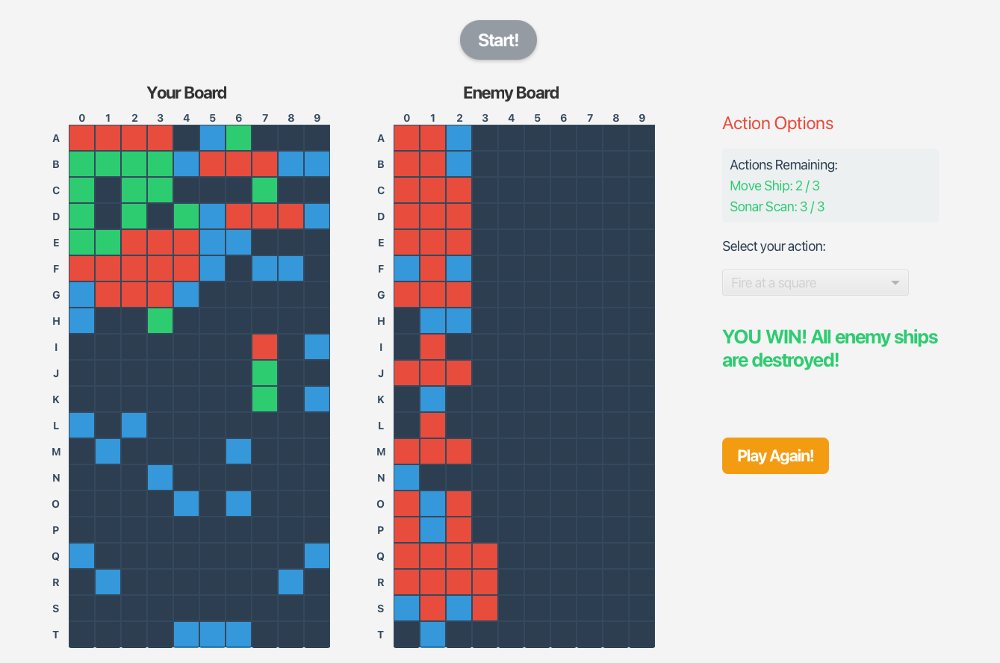
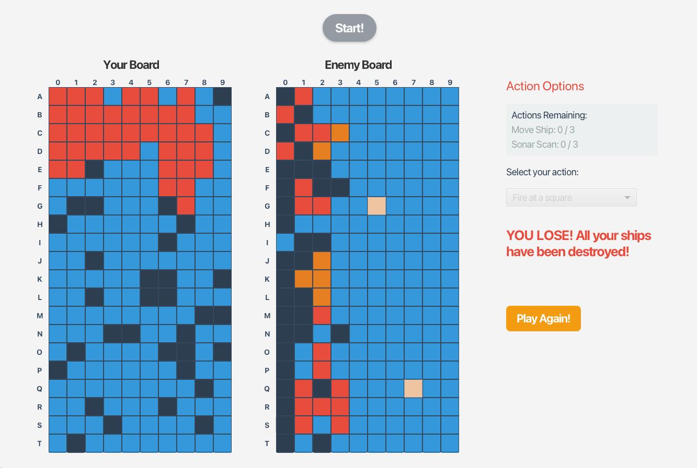

# Battleship

This application upgrades the text version of Battleship with a fully interactive user interface, intelligent computer.

## Key Features

### 1. Interactive Graphical Interface
* **Board View:** Players have a clear view of their own fleet on the left (Green) and the enemy's waters on the right (Dark Blue).
* **Color Feedback:** 
  * **Green:** Safe ship.
  * **Red:** Hit ship.
  * **Light Blue:** Missed shots.
  * **Orange:** Active selections (Moving ships or Sonar scan areas).
* **Dynamic Status Board:** A sidebar tracks available special actions, text output for both player and computer turns.

### 2. Ship Shapes
* **Submarine (2):** Standard 1x2 rectangle (Orientations: Vertical, Horizontal).
* **Destroyer (3):** Standard 1x3 rectangle (Orientations: Vertical, Horizontal).
* **Battleship (3):** Custom T-shaped vessel (Orientations: Up, Down, Left, Right).
* **Carrier (2):** Custom Z-shaped massive vessel (Orientations: Up, Down, Left, Right).

### 3. Strategic Placement Phase
* Players click to place their ships onto the grid.
* Custom orientation dropdowns automatically update based on the specific type of ship selected.

### 4. Combat
Once combat begins, players can choose from three distinct actions using the dropdown menu:

* **Fire at a square (Unlimited):**
  * Click the enemy board to launch an attack.
  * Hitting an enemy ship turns the square red,
* **Move a ship (3 Times):**
  * Select a surviving ship on your own board to relocate it.
  * Selected ship will become orange.
* **Sonar Scan (3 Times):**
  * Click any square on the enemy board to deploy sonar.
  * Highlights a sonar region in orange.
  * Reports the exact count of ships.
  
* **Check how many acitons left**
  * If all special actions used up, it will force user to be fire mode

    

### 5. Computer
* **Suspense Delay:** The computer pauses for 1 second before returning fire, allowing the player to process their own turn and creating a natural game flow.
* **Intelligent Target Tracking:** The AI utilizes a memory-based tracking system to actively hunt down your ships. 
  * **Coordinate Memory:** It perfectly remembers all previous hits and misses, ensuring it never wastes a turn firing at the same square twice.
  * **Hunt & Target Logic:**  Once the computer scores a successful hit, it dynamically switches from a random Hunt mode into a focused Target mode, prioritizing adjacent squares (Up, Down, Left, Right) to ruthlessly finish off the damaged ship before it sinks.

### 6. Game Over and replay
* A **"YOU WIN!"** or **"GAME OVER!"** message is displayed.
* A **"Play Again!"** button appears, allowing players to play again.

### Player Win

### Computer Win

